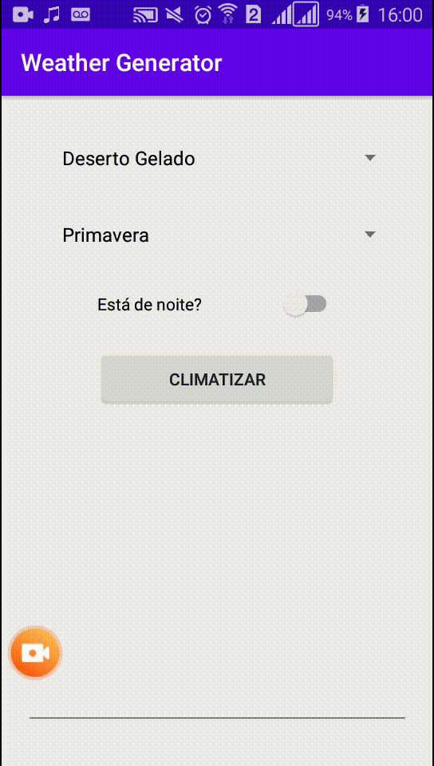

# Random Weather RPG

I made this app using android studio to create a description and a climate/weather using some information about the region.

Today, this project calculates temperature(Celsius), Wind speed(Km/h) and Rain(No rain, light rain, and heavy rain).

## Aplication Gif
 

## How it works
This aplication will generate a weather based on region, season, and if it's day or night.

### Region

Each Region has the following variables.

#### Name
The name will be showed in Spinner.

#### Min Temperature (C°)
Min Temperature sets how low can be your temperature in this region.

#### Max Temperatura (C°)
Max Temperature sets how high can be your temperature in this region.

#### Temperature Modifier (C°)
Temp Modifier sets how your temperature can change between seasons.

#### Max Wind Speed (Km/h)
Max wind speed sets how high can be the wind speed.

#### Seasons Precipitation
Seasons Precipitation sets how likely is to rain/snow in this terrain in each of seasons

### Seasons

Each season has it's own precipitation chances and winter days are likely to be colder than summer days, for example.
What sets this differences is mainly the Temperature modifier.

### Day/Night

If it's night time, it will be probably colder than the day.

## I want to use this project

If you are a DM or something like this, and you want to use this project just to have your own places/regions.
You can customize it as you want changing the weatherList, where I added my regions. It is just to add new regions, and you can use the region exactly as you want.

You can change the descriptions/translate it/do whatever you want changing them at strings.xml

If you have any question about this project, send an email to matheus@kiraitami.com
